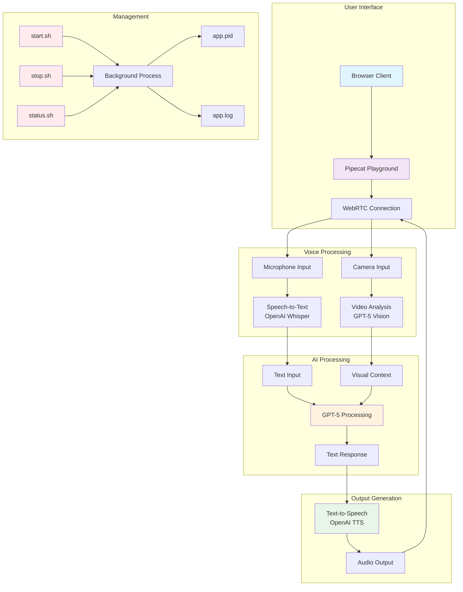
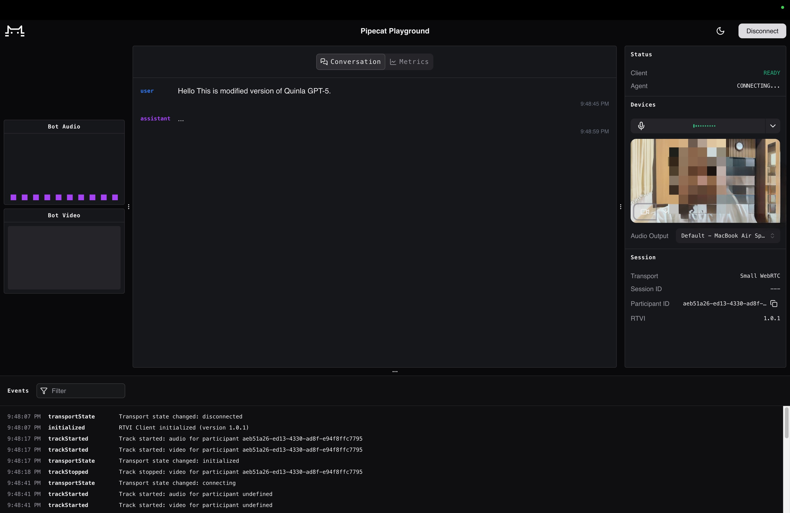

# GPT-5 Voice Agent

A real-time voice conversation agent powered by OpenAI's GPT-5, featuring speech-to-text, text-to-speech, and video stream analysis capabilities.

> **Original Source**: This project is based on the [GPT-5 voice agent single-file example](https://gist.github.com/kwindla/678ea297d12e24b928b636db928226fb#file-gpt-5-voice-agent-py) by [@kwindla](https://gist.github.com/kwindla).
> 
> **Original Post**: [X/Twitter announcement](https://x.com/kwindla/status/1953597224585494863) by [@kwindla](https://x.com/kwindla).

## 🎉 GPT-5 Voice Agent Release

This project is based on the original single-file voice agent that was released when GPT-5 became publicly available. The original announcement highlighted the simplicity and power of GPT-5 for voice AI applications.

### 🚀 Quick Start (Original Method)

```bash
# Set your OpenAI API key
export OPENAI_API_KEY=sk_proj-your-api-key-here

# Run the voice agent
uv run gpt-5-voice-agent.py
```

**Note**: First-time setup takes about 30 seconds to install dependencies and begin processing audio/video.

### ⚙️ Recommended GPT-5 Parameters for Voice AI

For optimal voice AI performance, use these parameter settings:

```python
service_tier: "priority"      # Doubles cost but reduces latency
reasoning_effort: "minimal"   # Faster responses for conversation
verbosity: "low"              # Concise responses for voice
```

The "priority" service tier is recommended for latency-sensitive conversational applications, though it doubles the cost per token.

### 🔧 Technical Architecture

The original implementation uses a three-model approach:
- **GPT-5**: Main conversation model
- **OpenAI Whisper**: Speech-to-text transcription
- **OpenAI TTS**: Text-to-speech generation

### 📚 Additional Resources

- **[Pipecat.ai Guide](https://docs.pipecat.ai/guides/features/openai-audio-models-and-apis)**: Comprehensive starter kit with both three-model and Realtime API approaches
- **[Voice AI & Voice Agents Primer](https://voiceaiandvoiceagents.com)**: Technical deep dive into building production voice agents
- **[Original Code Gist](https://gist.github.com/kwindla/678ea297d12e24b928b636db928226fb)**: The original single-file implementation

### 🎯 OpenAI Realtime API

OpenAI also released a new natively voice-to-voice Realtime model and API. For more information about using the Realtime API alongside the three-model approach, see the Pipecat.ai documentation above.

## 🌟 Features

- **Real-time Voice Conversations**: Natural voice interaction with GPT-5
- **Speech-to-Text**: Automatic transcription using OpenAI's Whisper
- **Text-to-Speech**: Natural voice responses using OpenAI's TTS
- **Video Stream Analysis**: Visual understanding of camera feed
- **Background Process Management**: Easy start/stop/status control
- **PID-based Process Control**: Reliable process management

## 🏗️ Architecture



## 🚀 Quick Start

### Prerequisites

- Python 3.12+
- [uv](https://docs.astral.sh/uv/) package manager
- OpenAI API key

### Installation

**Option 1: Automated Installation (Recommended)**
```bash
# Clone the repository
git clone https://github.com/abdshomad/gpt-5-voice-agent
cd gpt-5-voice-agent

# Run the automated installer
./install.sh
```

**Option 2: Manual Installation**
```bash
# Clone the repository
git clone https://github.com/abdshomad/gpt-5-voice-agent
cd gpt-5-voice-agent

# Install dependencies
uv sync

# Set up environment
cp .env.example .env
nano .env  # Add your OpenAI API key
```

### Configuration

Update the API key in `.env`:
```
OPENAI_API_KEY=sk_proj-your-actual-api-key-here
```

### Running the Application

```bash
# Start the application
./start.sh

# Access the app
# Open your browser and go to: http://localhost:7860/client

# Check status
./status.sh

# Stop the application
./stop.sh
```

## 📸 Screenshot



*The Pipecat Playground interface showing real-time voice conversation with GPT-5, including audio visualization, video stream, and conversation logs.*

## 📋 Management Scripts

### Install the App
```bash
./install.sh
```
- **Automated installation** with dependency checking
- **Verifies uv and Python** installation
- **Installs all dependencies** using `uv sync`
- **Sets up environment** file from template
- **Makes scripts executable**
- **Provides next steps** guidance

### Start the App
```bash
./start.sh
```
- Starts the voice agent in the background using `uv run`
- Saves PID to `app.pid`
- Logs output to `app.log`

### Stop the App
```bash
./stop.sh
```
- Gracefully stops the running app
- Removes PID file
- Frees port 7860

### Check Status
```bash
./status.sh
```
- Shows if app is running
- Displays recent logs
- Shows port status

## 🔧 Configuration

### Environment Variables (.env)

| Variable | Description | Required | Default |
|----------|-------------|----------|---------|
| `OPENAI_API_KEY` | Your OpenAI API key | ✅ Yes | - |
| `DEBUG` | Enable debug logging | ❌ No | `false` |
| `PORT` | Custom port | ❌ No | `7860` |

### Environment Setup

The project includes a `.env.example` file as a template:

```bash
# Copy the example file
cp .env.example .env

# Edit with your actual values
nano .env
```

**Required Setup**:
1. Get your OpenAI API key from [OpenAI Platform](https://platform.openai.com/api-keys)
2. Replace `sk_proj-your-openai-api-key-here` with your actual API key
3. Save the file

### Dependencies

The app uses `pyproject.toml` for dependency management with the following packages:

- `numba==0.61.2`
- `openai==1.99.1`
- `python-dotenv`
- `fastapi[all]`
- `uvicorn`
- `pipecat-ai[silero,webrtc,openai]`
- `pipecat-ai-small-webrtc-prebuilt`

**Development Dependencies** (optional):
- `pytest` - Testing framework
- `black` - Code formatting
- `flake8` - Linting
- `mypy` - Type checking

## 🎯 Usage

### Running the Application

1. **Start the app**: `./start.sh`
2. **Open browser**: Navigate to http://localhost:7860/client
3. **Allow camera/microphone**: Grant permissions when prompted
4. **Start talking**: Begin your voice conversation with GPT-5
5. **Ask about video**: Say "what can you see?" to analyze the camera feed

### Verification Commands

```bash
# Check if dependencies are installed
uv run python -c "import openai, pipecat_ai, fastapi; print('✅ Dependencies ready!')"

# Test the application
uv run python gpt-5-voice-agent.py --help

# Check running status
./status.sh

# Run the automated installer (if not already run)
./install.sh
```

## 🎥 Video Stream Features

The agent can analyze your camera feed in real-time:

- **Visual Questions**: Ask "what do you see?" or "describe the video"
- **Object Recognition**: Identify objects in the camera view
- **Scene Analysis**: Understand the context of your environment

## 🔍 Troubleshooting

### Port Already in Use
```bash
# Check what's using port 7860
lsof -i :7860

# Kill the process if needed
kill <PID>
```

### App Won't Start
1. Check logs: `tail -f app.log`
2. Verify API key in `.env`
3. Ensure all dependencies are installed: `uv sync`

### Audio Issues
- Check microphone permissions in browser
- Ensure microphone is not muted
- Try refreshing the browser page

### Video Issues
- Check camera permissions in browser
- Ensure camera is not in use by other applications
- Try refreshing the browser page

### Environment Issues
- Ensure `.env` file exists and has correct API key
- Check that `.env.example` was copied correctly
- Verify API key format starts with `sk_proj-`

## 📁 Project Structure

```
gpt-5-voice-agent-2025/
├── gpt-5-voice-agent.py    # Main application
├── pyproject.toml          # Project configuration and dependencies
├── install.sh              # Automated installation script
├── start.sh                # Start script (uses uv run)
├── stop.sh                 # Stop script
├── status.sh               # Status script
├── .env                    # Environment variables (create from .env.example)
├── .env.example           # Environment template
├── .gitignore             # Git ignore rules
├── INSTALL.md             # Detailed installation guide
└── README.md              # This file
```

## 📦 Package Management

The project uses `pyproject.toml` for modern Python packaging:

- **Dependencies**: All required packages are specified in `pyproject.toml`
- **Development Tools**: Includes configuration for testing, linting, and formatting
- **Build System**: Uses `hatchling` for building and packaging
- **Installation**: Can be installed with `pip install -e .` or `uv sync`

### ✅ Verified Installation

The project has been tested with the following dependencies:
- **94 packages** installed successfully
- **Core dependencies**: openai, pipecat-ai, fastapi, uvicorn
- **Audio processing**: numba, av, aiortc, pyloudnorm
- **Video processing**: opencv-python, pillow
- **Development tools**: pytest, black, flake8, mypy (optional)

### 🔧 Automated Installation

The `install.sh` script provides automated setup:
- **Dependency checking**: Verifies `uv` and Python installation
- **Automatic installation**: Uses `uv sync` for reliable dependency management
- **Environment setup**: Creates `.env` from template
- **Verification**: Tests core dependencies and application
- **User guidance**: Provides clear next steps

## 🛠️ Development

### Running in Development Mode
```bash
# Run directly with uv (recommended)
uv run gpt-5-voice-agent.py

# Or use the start script (also uses uv run)
./start.sh

# For development with auto-reload
uv run uvicorn gpt-5-voice-agent:app --reload --host 0.0.0.0 --port 7860
```

### Viewing Logs
```bash
# Real-time logs
tail -f app.log

# Recent logs
tail -20 app.log
```

### Stopping Development
```bash
# If running directly
Ctrl+C

# If running with start script
./stop.sh
```

## 🔐 Security Notes

- **API Key**: Never commit your `.env` file to version control
- **Environment Template**: Use `.env.example` as a safe template
- **Permissions**: The app requires camera and microphone access
- **Network**: Runs locally on localhost:7860

## 📝 License

This project is for educational and personal use. Please ensure you comply with OpenAI's usage policies.

## 🤝 Contributing

1. Fork the repository
2. Create a feature branch
3. Make your changes
4. Test thoroughly
5. Submit a pull request

## 📞 Support

If you encounter issues:

1. Check the logs: `tail -f app.log`
2. Verify your OpenAI API key in `.env`
3. Ensure all dependencies are installed
4. Check browser permissions for camera/microphone
5. Verify `.env` was created from `.env.example`

---

**Happy Voice Chatting! 🎤✨** 